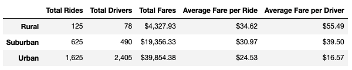
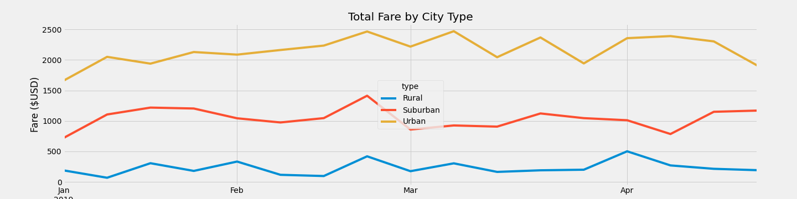

# PyBer_Analysis

## Overview of Analysis

### Purpose of Analysis

The purpose of this analysis is to present a summation of PyBer rides by city type between 1/1/2019 and 4/28/2019. Our merged data set included city type, date and time of ride, driver count, and fare. With this data, we are able to see a summation of total rides, total drivers, total fares, average fare per ride, and average fare per driver for urban, suburban, and rural city types. The analysis also presents the total weekly fares for each city type.

## Results

As seen in the below image, rural cities have the lowest total rides, drivers, and fares. Urban cities have the most rides, drivers, and fares and suburban cities are in the middle. However, rural cities have higher average fares per ride and average fares per driver. 

The fares are further illustrated in the below chart which also shows that urban cities have the most total fares, followed by suburban and rural.  Also of note, in the chart we see that the total fares per city type stay relatively consistent and the deviations of the peaks and dips are within the $500-700 range. What is interesting that all three city types experienced a spike in total fares towards the end of February.

## Summary

My first recommendation is for PyBer to look into what factors contributed to the late February peak. All three city types experienced this fare peak and by learning more about what factors lead to that spike could be useful insight into how to increase ridership and fares throughout all weeks. My second recommendation would be to collect data on the length of rides and distance of rides in each city type. I suspect that the infrastructure of rural cities means that although there are less rides and drivers, there may be longer rides and further distances while urban cities might have more rides and drivers but shorter distances. Finally, I would suggest that data is collected regarding the marketing of PyBer in each city type as well as a survey of needs in each city type. It may be that there is not enough marketing in rural cities or perhaps there are not enough drivers in rural cities to meet the potential demand. PyBer could also explore opportunities for government partnerships in rural areas to have the ride service be used for transporting individuals who are unable to drive to appointments and errands as a way to increase revenue in rural areas without instituting fare increases to increase total fares.

